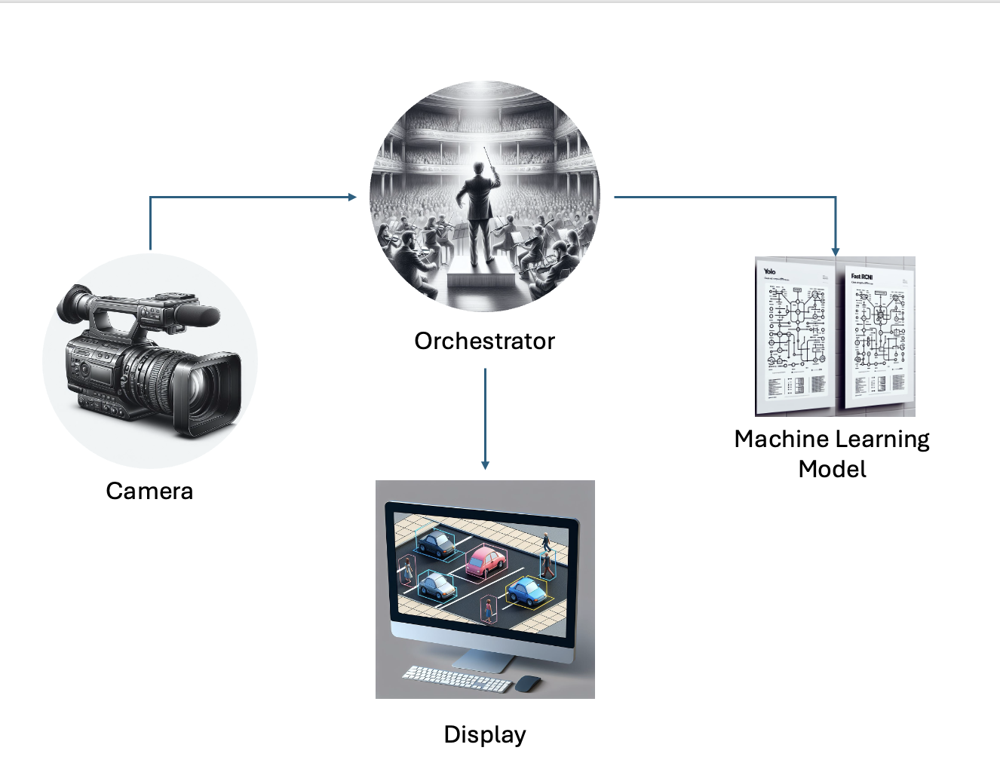

# Edge Vision

This repository contains the basic building blocks of a fully-functioning end-to-end vision on the edge solution.

The focus of this repository is to demonstrate how to build each block and how it functions. We have deliberately not included continuous integration, monitoring, or MLOps functions.

## Solution Summary

Edge Vision provides a modular approach to building vision solutions on edge devices. Each module is designed to handle a specific part of the process, from capturing images to processing and displaying results.

## Modules

- **Camera Utilities**: Tools and utilities for interfacing with camera hardware. [Read more](./camera-utilities/README.md)
- **Custom Vision**: Implements custom vision models for image recognition tasks. [Read more](./custom-vision/README.md)
- **Auto ML for Images**: Automated machine learning for image classification and object detection. [Read more](./auto-ml/README.md)
- **Orchestrator Building Blocks**: Core components for orchestrating the workflow between different modules. [Read more](./orchestrator-building-blocks/README.md)
- **Orchestrator App**: An application that manages the orchestration of different modules. [Read more](./orchestrator-app/README.md)
- **Player App**: An application for displaying processed images and results. [Read more](./player-app/README.md)

## DevContainers

Some of the modules in this repository use devcontainers. Each module has its own language and settings, so each module has its own devcontainer configuration.

## Author

Ren Silva  
Email: renato.silva@microsoft.com

## License

This project is licensed under the MIT License. See the [LICENSE](../../LICENSE) file for details.